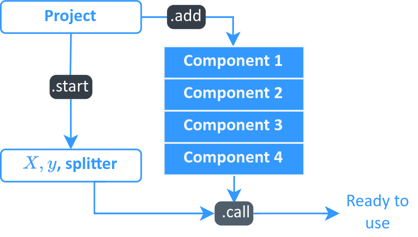

.. toctree::
   :maxdepth: 2
   :hidden:


Components
==========

This library empowers experienced users to integrate components,
allowing them to enhance their projects with optional analyses.
The goal is to seamlessly integrate analyses into projects using
the provided framework.

Adding Components
`````````````````

To add a component, simply use the method `.add` of `project` or `model`:

.. code-block:: python

    import pandas as pd
    import tempfile
    from sklearn import model_selection
    from sklearn.datasets import make_classification

    from palma import Project
    from palma import components

    X, y = make_classification(n_informative=2, n_features=100)
    X, y = pd.DataFrame(X), pd.Series(y).astype(bool)
    splitter = model_selection.ShuffleSplit(n_splits=10, random_state=42)
    project = Project(problem="classification", project_name="default")

    project.add(components.FileSystemLogger(tempfile.gettempdir()))  # Add an empty component
    project.start(X, y, splitter=splitter)                           # Execute the __call__ of all added components

Accessing the Components
````````````````````````

.. warning::
    This API is likely to change !

To access the components (for instance, those providing analysis methods and plots), do:

.. code-block:: python

    component = model.components["Component"]
    component




Implemented Components


**Associated to `Project`**


- `Profiler`: using Ydata profiling, create a report. Requires logger
- `DeepChecks`: run analysis to prevent data drift and data leakage

**Associated to `ModelEvaluation`**

- `ScoringAnalyser`: analysis tools for a classification problem
- `RegressionAnalyser`: analysis tools for a regression problem
- `ShapAnalyser`: local explanation using SHAP values

Create component
````````````````

Assume you have a function `fun(X, y, **parameters)` that makes some analysis; then, you can instantiate a component as follows:

.. code-block:: python

    from palma.components.base import ProjectComponent  # import base class
    from palma import logger

    def fun(X, y, **kwargs):
        return {"average" : y.mean()}

    class MyComponent(ProjectComponent):
        def __init__(self, **parameters):
            self.parameters = parameters

        def __call__(self, project):
            print("Component properly called")
            ret = fun(project.X, project.y, **self.parameters)
            logger.logger.log_metrics(ret, path="my_component") # log something
            return ret

And then use it in the following fashion:

.. code-block:: python

    project = Project(problem="classification", project_name="default")
    project.add(MyComponent())   # Add an empty component
    project.start(X, y, splitter=splitter)

If you want to create a `ModelEvaluation`'s component, the signature of the `__call__` is slightly different and should use both `project` and `model` objects:

.. code-block:: python

    def __call__(self, project, model):
        print("Component properly called")
        return fun(project.X, project.y, **self.parameters)

Log data
````````
Once the logger is configured, information can be recorded in the form of metrics, artifacts, or parameters.

*    A metric typically represents a score, a p-value, an error, or a rate.
*    An artifact can take the form of a figure (created with Matplotlib), a model, or any picklable object.
*    A parameter, akin to a metric, primarily pertains to algorithm parameters, contextualization data, and similar attributes.

.. code-block:: python

    from palma import logger
    from matplotlib.pyplot import figure
    logger.logger.log_metrics({"name_of_the_metric":1}, path="metric")
    logger.logger.log_artifact(figure(), path="figure")
    logger.logger.log_params({"name_of_the_parameter":1}, path="param")